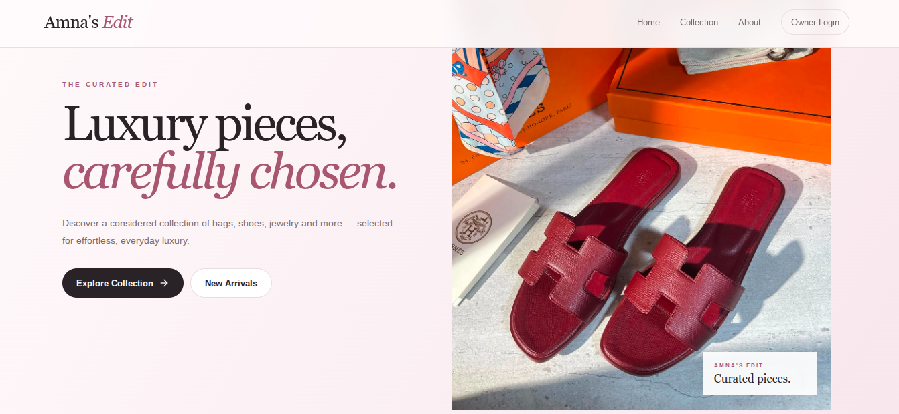
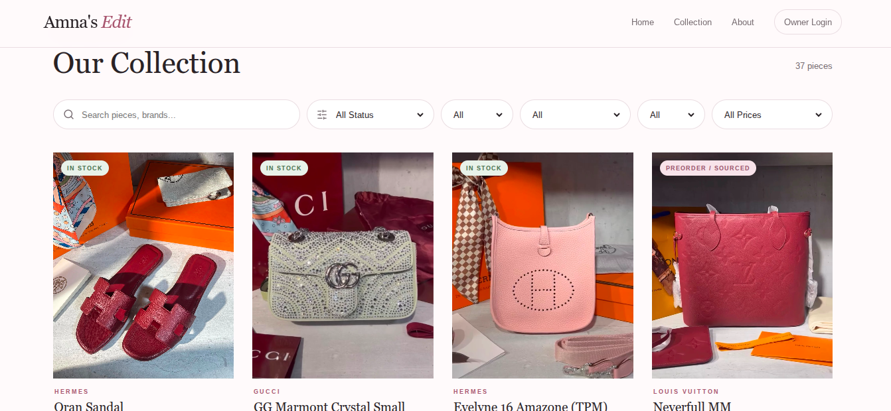
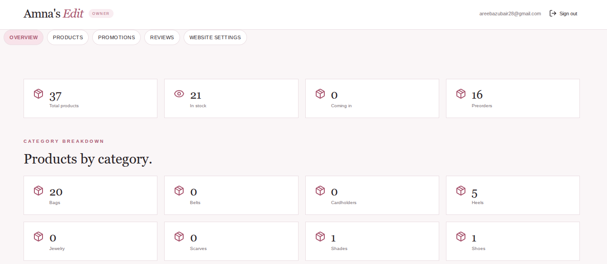
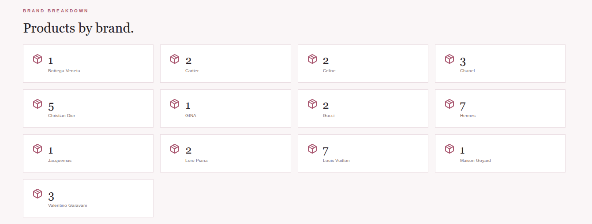
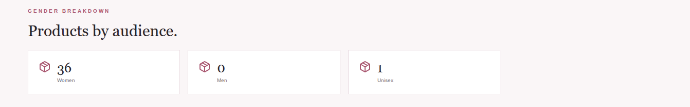

# Amna's Edit

A full-stack, inquiry-based fashion catalogue built with **Next.js, React, TypeScript, Supabase, and PostgreSQL**.

The platform provides a responsive product catalogue with search and filtering,
product variants, recommendations, scheduled promotions, customer reviews, and
an owner-only administration system.

> This project intentionally uses an inquiry-based model rather than traditional
> cart and checkout functionality. Customers browse products and contact the
> business through WhatsApp or Instagram.

## Live Demo

🌐 **[View Live Website](https://amnas-edit.vercel.app/)**

## Preview

### Home Page


### Product Catalogue


### Owner Dashboard




## Features

### Storefront

- Editorial-style homepage
- New arrivals section
- Searchable and filterable product catalogue
- Product filtering by:
  - status
  - category
  - brand
  - gender
  - price range
- Product status labels:
  - In Stock
  - Coming In
  - Preorder / Sourced
- Product detail modal
- Product color and variant support
- Variant-specific images, prices, and details
- Product recommendations
- Scheduled promotions and discount rules
- Customer reviews
- Public policies page
- WhatsApp and Instagram inquiry options

### Admin Dashboard

The owner dashboard provides dedicated sections for managing the website:

- `/admin` — dashboard overview
- `/admin/products` — products and variants
- `/admin/promotions` — promotions and discount rules
- `/admin/reviews` — customer review moderation
- `/admin/settings` — website content, policies, and contact information

The owner can:

- Create, update, and delete products
- Upload product and variant images
- Manage product variants and colors
- Assign brands and categories
- Manage product pricing, gender, and status
- Create scheduled promotions
- Apply promotions to products, categories, brands, genders, statuses, or the full catalogue
- Approve, hide, and delete reviews
- Edit website policies
- Edit About content
- Manage Instagram, WhatsApp, and TikTok details

## Tech Stack

- **Next.js 16.3.5**
- **React 19**
- **TypeScript**
- **Supabase**
  - PostgreSQL
  - Authentication
  - Row Level Security
  - Storage
- **Lucide React**
- **Vercel**

## Project Structure

```text
app/
├── admin/
│   ├── page.tsx
│   ├── products/page.tsx
│   ├── promotions/page.tsx
│   ├── reviews/page.tsx
│   └── settings/page.tsx
├── collection/page.tsx
├── login/page.tsx
├── policies/page.tsx
├── globals.css
├── layout.tsx
└── page.tsx

components/
├── AdminDashboard.tsx
├── Catalog.tsx
├── HomePage.tsx
├── Login.tsx
└── ProductModal.tsx

lib/
└── supabase.ts

supabase/
├── schema.sql
└── security_fix.sql

types/
└── product.ts
```

## Database

The project uses Supabase PostgreSQL for application data.

Main tables include:

- `profiles`
- `products`
- `categories`
- `brands`
- `product_variants`
- `site_settings`
- `promotions`
- `promotion_rules`
- `product_reviews`

Supabase Storage is used for product and variant images.

Row Level Security is used to restrict administrative operations to the owner account.

`schema.sql` contains the consolidated database schema for new setups, while `security_fix.sql` contains a one-time security migration for earlier database versions.

## Getting Started

Clone the repository:

```bash
git clone https://github.com/AreebaZubair28/amnas-edit.git
cd amnas-edit
```

Install dependencies:

```bash
npm install
```

Create a `.env.local` file based on `.env.example` and add the required values:

```env
NEXT_PUBLIC_SUPABASE_URL=your_supabase_url
NEXT_PUBLIC_SUPABASE_PUBLISHABLE_KEY=your_supabase_publishable_key
NEXT_PUBLIC_WHATSAPP_NUMBER=your_whatsapp_number
NEXT_PUBLIC_INSTAGRAM_URL=your_instagram_url
```

Run the development server:

```bash
npm run dev
```

Open:

```text
http://localhost:3000
```

## Database Setup

Run:

```text
supabase/schema.sql
```

in the Supabase SQL Editor.

Create the owner account in Supabase Authentication and assign the `owner` role in the `profiles` table.

Example:

```sql
insert into public.profiles (id, role)
values ('YOUR-AUTH-USER-UUID', 'owner')
on conflict (id) do update
set role = 'owner';
```

## Build

Create a production build with:

```bash
npm run build
```

## Security

The project uses:

- Supabase Authentication
- Row Level Security
- owner-only administrative permissions
- environment-based configuration
- restricted database write access
- controlled product image uploads

Project dependencies are regularly checked for known vulnerabilities using `npm audit`.

## Project Status

The core storefront and administration features are implemented, and the project passes a production build successfully.

## Future Improvements

Possible future enhancements include:

- admin management for brands and categories
- automated testing
- improved accessibility
- more detailed loading and error states
- performance optimization
- image optimization improvements
